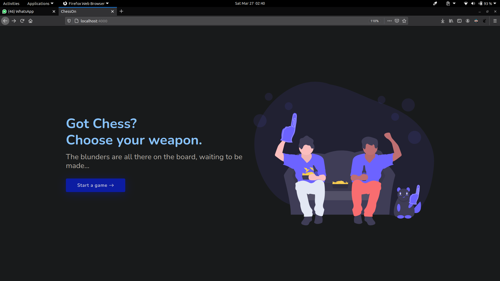
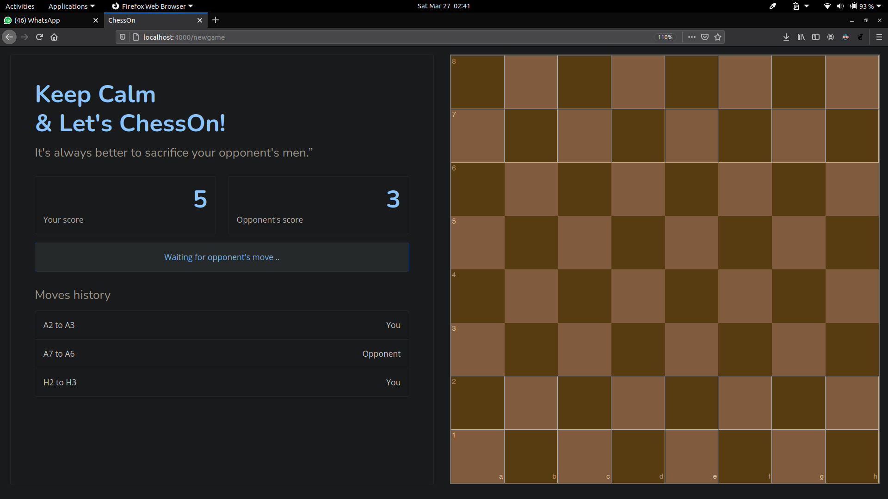

# ChessOn

 
## Inroduction
CheckMate is an internet chess server. Live online chess can be played against other users at daily, rapid. Chess versus an AI is currently offered. The site tracks all of your games and will help you to visualise your skills in a better way.

## Deployment server
Run `npm run build` for compiling and building front-end bundle.`nodemon server.js` to start the server Then  Navigate to `http://localhost:3000/`.
The app will start loading and you can join and start a game in a secure environment.

## Screenshots
### Landing Page
</img>

### Game 
</img>

## Features
1. Fast AI Bot as an opponent 
2. Live Scores
3. Move History
4. Game History
4. Platform Independent
